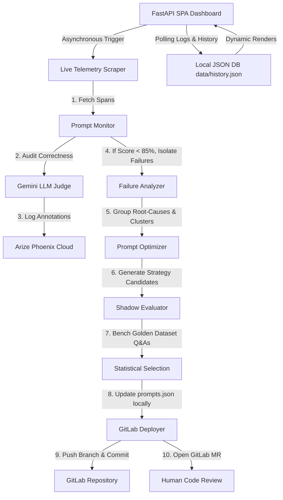

# 🤖 ElectroGadget Hub: Autonomous LLM Eval-to-Improvement Agent

An autonomous, production-grade **LLM Eval-to-Improvement Loop Agent** that watches live customer conversation telemetry, programmatically audits response correctness using LLM-as-a-Judge, diagnoses failure patterns, programmatically engineers improved prompt variants, runs shadow evaluations on a golden dataset to select a winner, and deploys the optimized prompts directly via a GitLab Merge Request—all controlled and visualized from a stunning, HSL-tailored glassmorphism dark-mode FastAPI control center dashboard.

---

## 📊 End-to-End System Architecture

Below is the structured data and control flow displaying how the different agent components coordinate the autonomous prompt optimization lifecycle:



---

## ✨ Features Breakdown

1. **Introspective Prompt Monitor (`monitor.py`)**: Programmatically pulls LLM traces from Arize Phoenix Cloud using the client API and executes OTel correctness evaluations back to the spans.
2. **Cluster Failure Analyzer (`analyzer.py`)**: Uses Pydantic schemas to guarantee structured JSON outputs from Gemini, grouping failures into root-cause categories (e.g. out-of-scope leak, token truncation).
3. **Programmatic Prompt Optimizer (`optimizer.py`)**: Generates 3 prompt strategies (*conservative surgical fixes*, *moderate structured workflows*, and *aggressive few-shot + negative constraints*).
4. **Double-Layer Shadow Evaluator (`evaluator.py`)**: Evaluates prompts against the Golden Dataset using a strict two-layer check (expected substring matching + zero-temperature LLM-as-a-Judge correctness). Equipped with exponential backoff API retries.
5. **GitOps GitLab Deployer (`gitlab_deployer.py`)**: Automates branching, commits, and opens a GitLab Merge Request with a comprehensive Markdown performance matrix.
6. **HSL Glassmorphic Web Dashboard (`app.py`)**: A gorgeous, single-page FastAPI controller featuring spinning glow spheres, terminal logs console, loading progress, and active prompt viewers.
7. **Pytest Suite (`test_agent.py`)**: Full test coverage of all components mocked deterministically for lightning-fast locally executed checks.

---

## 🛠️ Setup & Installation

### Prerequisites
- **Python 3.11** (stable virtual environment)
- **Node.js v18+** & **npm**
- **Git**

### Installation
1. Clone the repository and navigate to the project directory:
   ```bash
   cd AG-Agent-Hack
   ```
2. Instantiate a virtual environment using Python 3.11:
   ```bash
   /usr/bin/python3.11 -m venv .venv
   ```
3. Install the package manager **`uv`** inside the virtual environment:
   ```bash
   .venv/bin/pip install uv
   ```
4. Install all python dependencies ultra-fast in editable mode using `uv`:
   ```bash
   .venv/bin/uv pip install -r requirements.txt
   .venv/bin/uv pip install -e .
   ```

---

## 🔑 Environment Variables Configuration

Create a local `.env` file at the root of the project (copying placeholders from `.env.template`):

```ini
# Google Gemini API
GOOGLE_API_KEY="your-google-gemini-api-key"

# Arize Phoenix Cloud Telemetry
PHOENIX_API_KEY="your-phoenix-api-key"
PHOENIX_PROJECT_NAME="llm-eval-agent-v2"
PHOENIX_COLLECTOR_ENDPOINT="https://app.phoenix.arize.com/s/<your-space-name>"

# GitLab GitOps Integration
GITLAB_PERSONAL_ACCESS_TOKEN="your-gitlab-personal-access-token"
GITLAB_API_URL="https://gitlab.com/api/v4"
GITLAB_PROJECT_ID="your-username/llm-eval-agent"
GITLAB_DEFAULT_BRANCH="main"

# Dashboard Settings
DASHBOARD_HOST="0.0.0.0"
DASHBOARD_PORT=8000
```

---

## 🚀 Execution & Verification Scripts

The codebase is equipped with end-to-end verification scripts for every phase:

### 1. Telemetry Simulation
Generate live conversational traces and seed them to the Arize Phoenix Cloud dashboard:
```bash
.venv/bin/python scripts/simulate_traffic.py --num-runs 20 --delay 1.0
```

### 2. Introspection & Diagnostics
Retrieve spans programmatically, evaluate correctness, and run failure clustering:
```bash
.venv/bin/python scripts/verify_analysis.py
```

### 3. Optimization & Shadow Evaluations
Fetch spans, generate variants, shadow-evaluate them against the Golden Dataset, select a winner, and update local prompts:
```bash
.venv/bin/python scripts/verify_optimization.py
```

### 4. GitOps GitLab Deployment
Create a new branch, commit prompts configuration, and open a Merge Request on GitLab containing detailed comparison reports:
```bash
.venv/bin/python scripts/verify_deployment.py
```

### 5. Launch the Visual HSL Web Dashboard
Serve the FastAPI server to observe terminal logs, trigger cycles, and audit MR histories:
```bash
.venv/bin/python src/dashboard/app.py
```
👉 Open your browser and navigate to: **[http://localhost:8000](http://localhost:8000)**

### 6. Run the Pytest Suite
Execute all unit and integration tests with mock isolation:
```bash
PYTHONPATH=. .venv/bin/pytest tests/test_agent.py
```

---

## 🏆 Visual Verification Portals
- **Telemetry traces**: Check your collector project [Arize Phoenix Cloud Space](https://app.phoenix.arize.com).
- **GitOps Pull/Merge Requests**: Review the prompt updates, strategy diffs, and performance comparison matrices on your [GitLab Project Repository](https://gitlab.com).
