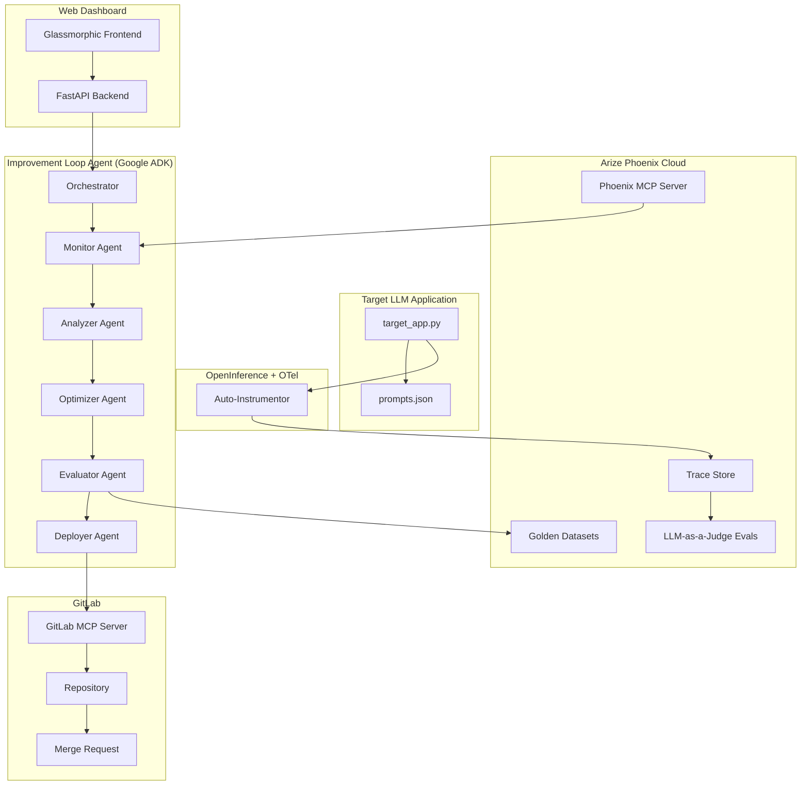

# LLM Eval-to-Improvement Loop Agent

## Project Overview

An autonomous, closed-loop AI engineering system for the **Google Cloud Rapid Agent Hackathon (2026)**.

The agent connects **Arize Phoenix Cloud** (LLM observability, tracing, and LLM-as-a-Judge evaluations) with **GitLab** (via MCP Server for branching, commits, and Merge Requests) to build a system that **ships agents that can self-improve**.

### What It Does

```
Monitor → Diagnose → Optimize → Evaluate → Deploy
```

1. **Monitor**: Continuously watches LLM traces in Arize Phoenix, tracking prompt template performance
2. **Diagnose**: Identifies which prompt templates are underperforming on which query types
3. **Optimize**: Auto-generates improved prompt variants using Gemini
4. **Evaluate**: Runs shadow evaluations (LLM-as-a-Judge) to select the winning variant
5. **Deploy**: Opens a GitLab Merge Request with the optimized prompt + rich evaluation report

### Why This Wins

- **Uses TWO partner tracks** (Arize + GitLab) — stronger submission
- **Meaningful MCP integration**: Phoenix MCP for runtime self-introspection + GitLab MCP for autonomous DevSecOps
- **Self-improvement loop**: The agent uses its own observability data to improve over time (Arize bonus points)
- **Real-world problem**: Prompt optimization is a genuine pain point in production AI systems

---

## Technical Stack

| Component | Technology | Purpose |
|---|---|---|
| **Agent Framework** | Google ADK (Agent Development Kit) | Agent orchestration, tool use, multi-step reasoning |
| **LLM** | Gemini 2.5 Flash / Pro | Agent reasoning + prompt variant generation |
| **Observability** | Arize Phoenix Cloud | Trace collection, LLM-as-a-Judge evals, datasets |
| **Phoenix MCP** | `@arizeai/phoenix-mcp` | Agent self-introspection of traces at runtime |
| **GitLab MCP** | `@structured-world/gitlab-mcp` | Autonomous branching, commits, MR creation |
| **Instrumentation** | OpenInference + OpenTelemetry | Auto-tracing of LLM calls to Phoenix |
| **Web Dashboard** | FastAPI + Vanilla HTML/CSS/JS | Premium control panel UI |
| **Deployment** | Google Cloud Agent Builder (optional) | Cloud deployment and scaling |

---

## Architecture Diagram



---

## Hackathon Qualification Checklist

- [x] **Partner Integration**: Arize Phoenix (MCP) + GitLab (MCP) — two partners
- [x] **Gemini Powered**: Uses Gemini 2.5 for agent reasoning and prompt generation
- [x] **Google Cloud Agent Builder**: ADK-based agent, deployable to Agent Engine
- [x] **Beyond Chat**: Agent autonomously monitors, diagnoses, optimizes, and deploys
- [x] **Multi-Step Mission**: 5-stage pipeline with planning and execution
- [x] **MCP Superpowers**: Phoenix MCP for self-introspection + GitLab MCP for DevOps
- [x] **Code-Owned Runtime**: Required by Arize track — using Google ADK
- [x] **OpenInference Tracing**: Auto-instrumented with `openinference-instrumentation-google-adk`
- [x] **LLM-as-a-Judge Evals**: Demonstrates quality evaluation pipeline
- [x] **Self-Improvement Loop**: Agent uses own observability data to improve (Arize bonus)

---

## Phase Summary

| Phase | Name | Key Deliverables | Est. Time |
|---|---|---|---|
| 1 | [Environment & Setup](01_setup.md) | Python env, credentials, project scaffold | 1-2 hours |
| 2 | [Target App & Instrumentation](02_target_app.md) | Instrumented LLM app, traffic simulator, Phoenix traces | 2-3 hours |
| 3 | [Phoenix Introspection & Diagnostics](03_phoenix_introspection.md) | Monitor agent, LLM-as-a-Judge evals, failure analysis | 3-4 hours |
| 4 | [Prompt Optimization & Shadow Evals](04_optimization.md) | Variant generator, shadow evaluator, winner selection | 3-4 hours |
| 5 | [GitLab DevSecOps via MCP](05_gitlab_integration.md) | Automated branching, commits, MR with eval report | 2-3 hours |
| 6 | [Web Dashboard & Orchestrator](06_dashboard.md) | Premium UI, full orchestration loop, E2E testing | 4-5 hours |
| 7 | [Polish, Testing & Submission](07_polish.md) | Documentation, demo video, Devpost submission | 2-3 hours |
