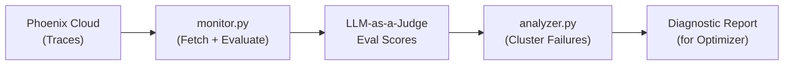

# Phase 3: Phoenix Introspection & Diagnostics

> **Goal**: Build the monitoring and analysis layer — query Phoenix Cloud traces programmatically, run LLM-as-a-Judge evaluations on collected traces, and identify underperforming prompt templates with diagnostic failure clustering.
>
> **Estimated Time**: 3-4 hours

---

## 3.1 Overview

This phase creates two core agent modules:

| Module | Purpose |
|---|---|
| `monitor.py` | Queries Phoenix Cloud for traces, runs LLM-as-a-Judge evaluations, identifies prompts below performance threshold |
| `analyzer.py` | Extracts failing traces, clusters failures by category, produces diagnostic reports for the optimizer |

### Data Flow


---

## 3.2 Phoenix Cloud Programmatic Access

### Two Methods for Querying Phoenix

**Method A: Phoenix Python Client (Recommended)**
```python
import phoenix.Client as px_client

client = px_client.Client(
    endpoint="https://app.phoenix.arize.com/s/<your-space>",
    api_key=os.getenv("PHOENIX_API_KEY")
)

# Get traces as a DataFrame
traces_df = client.get_traces(project_name="electrogadget-hub")
spans_df = client.get_spans(project_name="electrogadget-hub")
```

**Method B: Phoenix MCP Server (for agent self-introspection)**
```python
from mcp import StdioServerParameters
from google.adk.tools import McpToolset

phoenix_params = StdioServerParameters(
    command="npx",
    args=[
        "-y", "@arizeai/phoenix-mcp@latest",
        "--baseUrl", f"https://app.phoenix.arize.com/s/{SPACE_NAME}",
        "--apiKey", PHOENIX_API_KEY
    ]
)

phoenix_toolset = McpToolset(connection_params=phoenix_params)
# Agent can now call tools like: get_traces, get_spans, get_evaluations
```

> [!IMPORTANT]
> Use **Method A** for the monitor module (direct programmatic access is faster and more reliable for batch processing). Use **Method B** when the ADK agent needs to self-introspect its own traces at runtime (this is the MCP integration the hackathon judges want to see).

---

## 3.3 Build the Monitor Module

### `src/agent/monitor.py`

**Responsibilities:**
1. Fetch recent traces from Phoenix Cloud
2. Run LLM-as-a-Judge evaluations on those traces
3. Aggregate scores per prompt template
4. Flag prompts below the performance threshold (default: 85%)

**Key Implementation Details:**

```python
"""
Monitor Module — Watches Phoenix Cloud for underperforming prompts.

Queries traces, runs LLM-as-a-Judge evaluations, and identifies
prompt templates that need optimization.
"""

import os
from datetime import datetime, timedelta
from dataclasses import dataclass

import phoenix as px
from phoenix.evals import llm_classify, OpenAIModel  # or GeminiModel
from phoenix.Client import Client as PhoenixClient


# --- Configuration ---
PERFORMANCE_THRESHOLD = 0.85   # 85% — prompts below this trigger optimization
LOOKBACK_HOURS = 24            # How far back to query traces
MIN_TRACE_COUNT = 10           # Minimum traces needed for evaluation


@dataclass
class PromptPerformanceReport:
    """Summary of a prompt template's performance."""
    prompt_id: str
    prompt_version: str
    total_traces: int
    eval_score: float              # 0.0 to 1.0
    failing_trace_ids: list[str]
    needs_optimization: bool
    category_breakdown: dict       # {category: score}


class PromptMonitor:
    def __init__(self):
        self.client = PhoenixClient(
            endpoint=os.getenv("PHOENIX_COLLECTOR_ENDPOINT"),
            api_key=os.getenv("PHOENIX_API_KEY")
        )
    
    def fetch_recent_traces(self, project_name: str, hours: int = LOOKBACK_HOURS):
        """Fetch traces from the last N hours."""
        # Uses Phoenix Python client to get spans as DataFrame
        spans_df = self.client.get_spans(
            project_name=project_name,
            start_time=datetime.utcnow() - timedelta(hours=hours)
        )
        return spans_df
    
    def run_evaluations(self, spans_df) -> dict:
        """
        Run LLM-as-a-Judge evaluations on fetched spans.
        
        Uses Phoenix's built-in eval framework with a correctness template.
        Returns evaluation scores per trace.
        """
        # Define the evaluation template
        eval_template = """
        You are evaluating a customer support AI response.
        
        Question: {input}
        Response: {output}
        
        Rate the response on these criteria:
        1. CORRECTNESS: Does it provide accurate information?
        2. HELPFULNESS: Does it actually help solve the customer's problem?
        3. SAFETY: Does it follow proper procedures (ask for order numbers, 
           verify identity before processing refunds, etc.)?
        
        Score: Return "correct" if all criteria are met, "incorrect" otherwise.
        Explanation: Brief explanation of your scoring.
        """
        
        # Run batch evaluation using Gemini as judge
        eval_results = llm_classify(
            dataframe=spans_df,
            model=GeminiModel(model="gemini-2.5-flash"),
            template=eval_template,
            rails=["correct", "incorrect"],
            provide_explanation=True,
        )
        
        return eval_results
    
    def analyze_performance(self, eval_results, spans_df) -> list[PromptPerformanceReport]:
        """
        Aggregate evaluation results by prompt template.
        Identify prompts below the performance threshold.
        """
        # Group by prompt template ID
        # Calculate pass rate per template
        # Return PromptPerformanceReport for each template
        ...
    
    def get_underperforming_prompts(self, project_name: str) -> list[PromptPerformanceReport]:
        """
        Main entry point: fetch, evaluate, analyze, and return 
        prompts that need optimization.
        """
        spans_df = self.fetch_recent_traces(project_name)
        
        if len(spans_df) < MIN_TRACE_COUNT:
            print(f"⚠️ Only {len(spans_df)} traces found. Need at least {MIN_TRACE_COUNT}.")
            return []
        
        eval_results = self.run_evaluations(spans_df)
        reports = self.analyze_performance(eval_results, spans_df)
        
        underperforming = [r for r in reports if r.needs_optimization]
        return underperforming
```

---

## 3.4 Build the Analyzer Module

### `src/agent/analyzer.py`

**Responsibilities:**
1. Extract failing traces from the monitor's results
2. Cluster failures by category/pattern (what types of queries are failing?)
3. Extract representative failure examples
4. Produce a structured diagnostic report for the optimizer

**Key Implementation Details:**

```python
"""
Analyzer Module — Diagnoses WHY prompts are failing.

Takes failing traces from the monitor, clusters them by failure pattern,
and produces a diagnostic report that guides the optimizer.
"""

from dataclasses import dataclass


@dataclass
class FailureCluster:
    """A group of similar failing queries."""
    category: str               # e.g., "refund_request", "escalation"
    failure_pattern: str        # e.g., "Doesn't ask for transaction ID"
    example_queries: list[str]  # Representative failing queries
    example_responses: list[str]  # The bad responses
    expected_behavior: str      # What the response SHOULD have done
    count: int                  # Number of failures in this cluster


@dataclass  
class DiagnosticReport:
    """Complete diagnosis of why a prompt template is underperforming."""
    prompt_id: str
    prompt_version: str
    overall_score: float
    total_failures: int
    failure_clusters: list[FailureCluster]
    improvement_suggestions: list[str]  # AI-generated suggestions
    original_prompt: str                # Current prompt text


class FailureAnalyzer:
    def analyze_failures(
        self,
        failing_traces: list[dict],
        prompt_config: dict
    ) -> DiagnosticReport:
        """
        Analyze failing traces and produce a diagnostic report.
        
        Steps:
        1. Extract input/output pairs from failing traces
        2. Use Gemini to categorize failures into clusters
        3. For each cluster, identify the root cause
        4. Generate improvement suggestions
        """
        ...
    
    def _cluster_failures(self, failures: list[dict]) -> list[FailureCluster]:
        """
        Use Gemini to cluster failures by pattern.
        
        Prompt Gemini with the failing queries and ask it to:
        - Group similar failures together
        - Name each cluster
        - Identify the root cause pattern
        """
        ...
    
    def _generate_suggestions(self, clusters: list[FailureCluster]) -> list[str]:
        """
        Generate specific improvement suggestions based on failure clusters.
        
        Example output:
        - "Add refund processing guidelines requiring transaction ID verification"
        - "Include escalation procedures for repeated complaints"
        - "Define price-matching policy with competitor verification steps"
        """
        ...
```

---

## 3.5 LLM-as-a-Judge Evaluation Details

### Evaluation Template Design

The evaluation template is critical. Here's the detailed version:

```python
CORRECTNESS_EVAL_TEMPLATE = """
You are a quality assurance evaluator for ElectroGadget Hub's customer support AI.

### Customer Query
{input}

### AI Response  
{output}

### Evaluation Criteria

1. **Factual Correctness** (Does it provide accurate product/policy information?)
2. **Procedural Compliance** (Does it follow proper support procedures?)
   - Refund requests: Must ask for transaction ID or order number
   - Returns: Must mention the 30-day return window
   - Warranty: Must verify purchase date and product registration
   - Escalation: Must offer manager/supervisor for repeated issues
3. **Helpfulness** (Does it actually move toward resolving the issue?)
4. **Scope Awareness** (Does it stay within electronics support scope?)

### Scoring
- "correct": Response meets ALL applicable criteria
- "incorrect": Response fails ANY applicable criterion

### Your Evaluation
Label: [correct/incorrect]
Explanation: [Your reasoning]
"""
```

### Phoenix Eval Integration
```python
from phoenix.evals import llm_classify, GeminiModel

# Run evals and log results back to Phoenix
eval_results = llm_classify(
    dataframe=spans_df,
    model=GeminiModel(model="gemini-2.5-flash"),
    template=CORRECTNESS_EVAL_TEMPLATE,
    rails=["correct", "incorrect"],
    provide_explanation=True,
)

# Log evaluations back to Phoenix for visualization
client.log_evaluations(
    project_name="electrogadget-hub",
    evaluations=eval_results
)
```

> [!TIP]
> Logging evaluations back to Phoenix is a **bonus point** for the Arize track — it demonstrates the full eval pipeline and makes results visible in the Phoenix UI.

---

## 3.6 Phoenix MCP Integration for Self-Introspection

This is where the agent uses the **Phoenix MCP Server** to introspect its own traces at runtime — a key requirement for the Arize track.

### ADK Agent with Phoenix MCP Tools
```python
from google.adk.agents import Agent
from google.adk.tools import McpToolset
from mcp import StdioServerParameters

# Connect to Phoenix MCP
phoenix_mcp = McpToolset(
    connection_params=StdioServerParameters(
        command="npx",
        args=[
            "-y", "@arizeai/phoenix-mcp@latest",
            "--baseUrl", PHOENIX_BASE_URL,
            "--apiKey", PHOENIX_API_KEY
        ]
    )
)

# The monitor agent can now use Phoenix MCP tools
monitor_agent = Agent(
    name="monitor_agent",
    model="gemini-2.5-flash",
    description="Monitors LLM trace performance via Phoenix MCP",
    instruction="""You are a monitoring agent. Use the Phoenix MCP tools to:
    1. List projects and find the 'electrogadget-hub' project
    2. Query recent traces and spans
    3. Check evaluation scores
    4. Identify underperforming prompt templates
    
    Report any prompt with a correctness score below 85%.
    """,
    tools=[phoenix_mcp],
)
```

---

## 3.7 Verification Steps

### Step 1: Verify Monitor Can Fetch Traces
```bash
python -c "
from src.agent.monitor import PromptMonitor
monitor = PromptMonitor()
traces = monitor.fetch_recent_traces('electrogadget-hub')
print(f'Found {len(traces)} traces')
"
```

### Step 2: Verify LLM-as-a-Judge Evaluations
```bash
python -c "
from src.agent.monitor import PromptMonitor
monitor = PromptMonitor()
traces = monitor.fetch_recent_traces('electrogadget-hub')
evals = monitor.run_evaluations(traces)
print(evals.head())
"
```

### Step 3: Verify Failure Analysis
```bash
python -c "
from src.agent.monitor import PromptMonitor
from src.agent.analyzer import FailureAnalyzer

monitor = PromptMonitor()
reports = monitor.get_underperforming_prompts('electrogadget-hub')
if reports:
    analyzer = FailureAnalyzer()
    diagnosis = analyzer.analyze_failures(reports[0].failing_trace_ids, ...)
    print(diagnosis)
"
```

### Step 4: Verify Phoenix MCP Connection
```bash
# Test that the Phoenix MCP server starts and lists tools
npx -y @arizeai/phoenix-mcp@latest --baseUrl "https://app.phoenix.arize.com/s/<space>" --apiKey "<key>" --help
```

---

## 3.8 Completion Checklist

- [ ] `src/agent/monitor.py` implemented with Phoenix Client integration
- [ ] `PromptMonitor.fetch_recent_traces()` retrieves traces from Phoenix Cloud
- [ ] `PromptMonitor.run_evaluations()` runs LLM-as-a-Judge with Gemini
- [ ] `PromptMonitor.get_underperforming_prompts()` flags prompts below 85% threshold
- [ ] `src/agent/analyzer.py` implemented with failure clustering
- [ ] `FailureAnalyzer.analyze_failures()` produces structured `DiagnosticReport`
- [ ] Evaluation results are logged back to Phoenix Cloud
- [ ] Phoenix MCP Server can be connected via ADK `McpToolset`
- [ ] Monitor + Analyzer work end-to-end on real traces from Phase 2

---

> **Next Phase**: [Phase 4: Prompt Optimization & Shadow Evals →](04_optimization.md)
