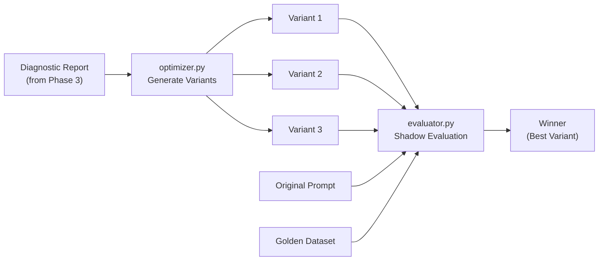

# Phase 4: Prompt Optimization & Shadow Evaluations

> **Goal**: Build the prompt variant generator (using Gemini) and the shadow evaluation engine that tests variants against a golden dataset to select the statistically best candidate — all without touching production.
>
> **Estimated Time**: 3-4 hours

---

## 4.1 Overview

This phase creates two core modules:

| Module | Purpose |
|---|---|
| `optimizer.py` | Takes a diagnostic report → generates 3 improved prompt variants using Gemini |
| `evaluator.py` | Runs all variants (+ original) against golden dataset → LLM-as-a-Judge selects winner |

### Data Flow


---

## 4.2 Build the Optimizer Module

### `src/agent/optimizer.py`

**Responsibilities:**
1. Accept a `DiagnosticReport` from the analyzer
2. Construct a meta-prompt that instructs Gemini to generate improved prompt variants
3. Generate exactly **3** candidate prompt variants
4. Each variant should address specific failure clusters from the diagnostic

**Key Design Decisions:**
- Generate exactly 3 variants (not too few to compare, not too many to evaluate)
- Each variant takes a different optimization strategy (conservative, moderate, aggressive)
- The meta-prompt includes the original prompt, failure examples, and improvement suggestions

```python
"""
Optimizer Module — Generates improved prompt variants using Gemini.

Takes a diagnostic report (from the analyzer) and uses Gemini to 
auto-generate 3 prompt template variants, each targeting identified 
failure patterns from different angles.
"""

import os
import json
from dataclasses import dataclass

from google import genai
from src.agent.analyzer import DiagnosticReport, FailureCluster


@dataclass
class PromptVariant:
    """A candidate prompt template generated by the optimizer."""
    variant_id: str             # e.g., "v1_conservative"
    strategy: str               # "conservative", "moderate", "aggressive"
    system_instruction: str     # The new prompt text
    changes_description: str    # What was changed and why
    targeted_clusters: list[str]  # Which failure clusters this targets


VARIANT_GENERATION_PROMPT = """
You are an expert prompt engineer. Your task is to improve an underperforming 
LLM prompt template based on diagnostic data from production traces.

## Current Prompt Template
```
{original_prompt}
```

## Performance Data
- Current correctness score: {score:.1%}
- Total traces evaluated: {total_traces}
- Total failures: {total_failures}

## Failure Analysis
{failure_clusters_text}

## Your Task
Generate exactly 3 improved prompt variants with different strategies:

### Variant 1: CONSERVATIVE
- Make minimal, targeted changes
- Add only the missing instructions for the specific failure patterns identified
- Preserve the original tone and structure

### Variant 2: MODERATE  
- Restructure the prompt for clarity
- Add comprehensive handling for all identified failure categories
- Add structured response guidelines

### Variant 3: AGGRESSIVE
- Complete rewrite optimized for correctness and safety
- Add detailed decision trees for each scenario type
- Include explicit examples of correct behavior
- Add guardrails and edge case handling

## Output Format
Return a JSON array with exactly 3 objects:
```json
[
  {{
    "variant_id": "v1_conservative",
    "strategy": "conservative", 
    "system_instruction": "...",
    "changes_description": "..."
  }},
  {{
    "variant_id": "v2_moderate",
    "strategy": "moderate",
    "system_instruction": "...",
    "changes_description": "..."
  }},
  {{
    "variant_id": "v3_aggressive",
    "strategy": "aggressive",
    "system_instruction": "...",
    "changes_description": "..."
  }}
]
```

IMPORTANT: Each system_instruction must be a complete, standalone prompt. 
Do not use placeholders or references to the original.
"""


class PromptOptimizer:
    def __init__(self):
        self.client = genai.Client(api_key=os.getenv("GOOGLE_API_KEY"))
    
    def generate_variants(self, diagnostic: DiagnosticReport) -> list[PromptVariant]:
        """
        Generate 3 prompt variants based on the diagnostic report.
        
        Uses Gemini to analyze failure patterns and create targeted improvements.
        """
        # Format failure clusters for the meta-prompt
        clusters_text = self._format_clusters(diagnostic.failure_clusters)
        
        # Build the meta-prompt
        prompt = VARIANT_GENERATION_PROMPT.format(
            original_prompt=diagnostic.original_prompt,
            score=diagnostic.overall_score,
            total_traces=diagnostic.total_failures + int(diagnostic.total_failures / (1 - diagnostic.overall_score + 0.01)),
            total_failures=diagnostic.total_failures,
            failure_clusters_text=clusters_text,
        )
        
        # Generate variants using Gemini
        response = self.client.models.generate_content(
            model="gemini-2.5-flash",
            contents=prompt,
            config=genai.types.GenerateContentConfig(
                temperature=0.7,  # Some creativity for diverse variants
                response_mime_type="application/json",
            )
        )
        
        # Parse the JSON response
        variants_data = json.loads(response.text)
        
        variants = []
        for v in variants_data:
            variants.append(PromptVariant(
                variant_id=v["variant_id"],
                strategy=v["strategy"],
                system_instruction=v["system_instruction"],
                changes_description=v["changes_description"],
                targeted_clusters=[c.category for c in diagnostic.failure_clusters],
            ))
        
        return variants
    
    def _format_clusters(self, clusters: list[FailureCluster]) -> str:
        """Format failure clusters into readable text for the meta-prompt."""
        lines = []
        for i, cluster in enumerate(clusters, 1):
            lines.append(f"### Failure Cluster {i}: {cluster.category}")
            lines.append(f"- Pattern: {cluster.failure_pattern}")
            lines.append(f"- Count: {cluster.count} failures")
            lines.append(f"- Expected behavior: {cluster.expected_behavior}")
            lines.append(f"- Example query: \"{cluster.example_queries[0]}\"")
            lines.append(f"- Bad response excerpt: \"{cluster.example_responses[0][:200]}\"")
            lines.append("")
        return "\n".join(lines)
```

---

## 4.3 Build the Evaluator Module

### `src/agent/evaluator.py`

**Responsibilities:**
1. Take the 3 generated variants + the original prompt
2. Run each against the full golden dataset
3. Score each response using LLM-as-a-Judge
4. Compute aggregate statistics per variant
5. Select the winner with statistical confidence

```python
"""
Evaluator Module — Shadow evaluation engine.

Runs prompt variants against a golden dataset WITHOUT touching production.
Uses LLM-as-a-Judge to score each variant and selects the statistical winner.
"""

import json
import os
import time
from dataclasses import dataclass
from pathlib import Path

from google import genai
from src.agent.optimizer import PromptVariant


@dataclass
class EvalResult:
    """Evaluation result for a single query against a single variant."""
    variant_id: str
    query_id: str
    query: str
    response: str
    score: float            # 0.0 or 1.0 (binary correctness)
    explanation: str        # Judge's reasoning
    latency_ms: float      # Response time
    token_count: int        # Output tokens used


@dataclass
class VariantScorecard:
    """Aggregate evaluation results for a single variant."""
    variant_id: str
    strategy: str
    total_queries: int
    correct_count: int
    accuracy: float               # correct_count / total_queries
    avg_latency_ms: float
    avg_tokens: float
    category_scores: dict         # {category: accuracy}
    failing_query_ids: list[str]  # Which queries it still fails
    improvement_vs_original: float  # Percentage point improvement


@dataclass
class EvaluationReport:
    """Complete shadow evaluation report comparing all variants."""
    original_scorecard: VariantScorecard
    variant_scorecards: list[VariantScorecard]
    winner: VariantScorecard
    winner_variant: PromptVariant      # The full variant config
    confidence: str                     # "high", "medium", "low"
    summary: str                        # Human-readable summary


JUDGE_TEMPLATE = """
You are evaluating a customer support AI response for ElectroGadget Hub.

### Customer Query
{query}

### AI Response
{response}

### Expected Answer Should Contain
{expected_keywords}

### Evaluation
Does the response correctly and helpfully address the customer's query?
Does it contain the expected information or follow the correct procedure?

Score: "correct" if the response is adequate, "incorrect" if it fails.
Explanation: Brief reasoning (1-2 sentences).

Return JSON: {{"score": "correct" or "incorrect", "explanation": "..."}}
"""


class ShadowEvaluator:
    def __init__(self):
        self.client = genai.Client(api_key=os.getenv("GOOGLE_API_KEY"))
        self.golden_dataset = self._load_golden_dataset()
    
    def _load_golden_dataset(self) -> list[dict]:
        """Load the golden dataset for evaluation."""
        path = Path(__file__).parent.parent.parent / "data" / "golden_dataset.json"
        with open(path) as f:
            data = json.load(f)
        return data["entries"]
    
    def evaluate_variant(self, variant: PromptVariant) -> list[EvalResult]:
        """
        Run a single variant against the entire golden dataset.
        Returns individual eval results for each query.
        """
        results = []
        
        for entry in self.golden_dataset:
            # Run the LLM with this variant's prompt
            start = time.time()
            response = self.client.models.generate_content(
                model="gemini-2.5-flash",
                contents=entry["query"],
                config=genai.types.GenerateContentConfig(
                    system_instruction=variant.system_instruction,
                    temperature=0.3,
                )
            )
            latency = (time.time() - start) * 1000
            
            # Judge the response
            judge_result = self._judge_response(
                query=entry["query"],
                response=response.text,
                expected_keywords=entry["expected_answer_contains"],
            )
            
            results.append(EvalResult(
                variant_id=variant.variant_id,
                query_id=entry["id"],
                query=entry["query"],
                response=response.text,
                score=1.0 if judge_result["score"] == "correct" else 0.0,
                explanation=judge_result["explanation"],
                latency_ms=latency,
                token_count=len(response.text.split()),  # Approximate
            ))
            
            time.sleep(0.5)  # Rate limiting
        
        return results
    
    def _judge_response(self, query: str, response: str, expected_keywords: list[str]) -> dict:
        """Use Gemini as LLM-as-a-Judge to score a response."""
        judge_prompt = JUDGE_TEMPLATE.format(
            query=query,
            response=response,
            expected_keywords=", ".join(expected_keywords),
        )
        
        result = self.client.models.generate_content(
            model="gemini-2.5-flash",
            contents=judge_prompt,
            config=genai.types.GenerateContentConfig(
                temperature=0.0,
                response_mime_type="application/json",
            )
        )
        
        return json.loads(result.text)
    
    def run_full_evaluation(
        self,
        original_prompt: str,
        variants: list[PromptVariant],
    ) -> EvaluationReport:
        """
        Run shadow evaluation for all variants + original.
        
        Steps:
        1. Evaluate the original prompt (baseline)
        2. Evaluate each variant
        3. Compute scorecards
        4. Select winner
        5. Generate report
        """
        # Create a "variant" for the original
        original_variant = PromptVariant(
            variant_id="original",
            strategy="baseline",
            system_instruction=original_prompt,
            changes_description="Original prompt (no changes)",
            targeted_clusters=[],
        )
        
        # Evaluate all (original + 3 variants = 4 evaluations)
        all_variants = [original_variant] + variants
        all_results = {}
        
        for variant in all_variants:
            print(f"🔄 Evaluating variant: {variant.variant_id} ({variant.strategy})")
            results = self.evaluate_variant(variant)
            all_results[variant.variant_id] = results
            print(f"   Score: {sum(r.score for r in results)/len(results):.1%}")
        
        # Compute scorecards
        scorecards = {}
        for variant in all_variants:
            results = all_results[variant.variant_id]
            scorecard = self._compute_scorecard(variant, results)
            scorecards[variant.variant_id] = scorecard
        
        # Select winner (highest accuracy, tiebreak by latency)
        original_card = scorecards["original"]
        variant_cards = [scorecards[v.variant_id] for v in variants]
        
        for card in variant_cards:
            card.improvement_vs_original = card.accuracy - original_card.accuracy
        
        winner_card = max(variant_cards, key=lambda c: (c.accuracy, -c.avg_latency_ms))
        winner_variant = next(v for v in variants if v.variant_id == winner_card.variant_id)
        
        # Determine confidence
        confidence = self._assess_confidence(original_card, winner_card)
        
        return EvaluationReport(
            original_scorecard=original_card,
            variant_scorecards=variant_cards,
            winner=winner_card,
            winner_variant=winner_variant,
            confidence=confidence,
            summary=self._generate_summary(original_card, variant_cards, winner_card),
        )
    
    def _compute_scorecard(self, variant, results) -> VariantScorecard:
        """Compute aggregate metrics for a variant's evaluation results."""
        correct = sum(1 for r in results if r.score == 1.0)
        total = len(results)
        
        # Category breakdown
        categories = {}
        for r in results:
            entry = next(e for e in self.golden_dataset if e["id"] == r.query_id)
            cat = entry["category"]
            if cat not in categories:
                categories[cat] = {"correct": 0, "total": 0}
            categories[cat]["total"] += 1
            if r.score == 1.0:
                categories[cat]["correct"] += 1
        
        cat_scores = {cat: d["correct"]/d["total"] for cat, d in categories.items()}
        
        return VariantScorecard(
            variant_id=variant.variant_id,
            strategy=variant.strategy,
            total_queries=total,
            correct_count=correct,
            accuracy=correct / total if total > 0 else 0,
            avg_latency_ms=sum(r.latency_ms for r in results) / total,
            avg_tokens=sum(r.token_count for r in results) / total,
            category_scores=cat_scores,
            failing_query_ids=[r.query_id for r in results if r.score == 0.0],
            improvement_vs_original=0.0,  # Computed later
        )
    
    def _assess_confidence(self, original, winner) -> str:
        """Assess confidence in the winner selection."""
        improvement = winner.accuracy - original.accuracy
        if improvement >= 0.15 and winner.accuracy >= 0.90:
            return "high"
        elif improvement >= 0.05:
            return "medium"
        else:
            return "low"
    
    def _generate_summary(self, original, variants, winner) -> str:
        """Generate a human-readable evaluation summary."""
        lines = [
            f"## Shadow Evaluation Summary",
            f"",
            f"**Original Accuracy**: {original.accuracy:.1%}",
            f"**Winner**: {winner.variant_id} ({winner.strategy})",
            f"**Winner Accuracy**: {winner.accuracy:.1%}",
            f"**Improvement**: +{winner.improvement_vs_original:.1%}",
            f"**Confidence**: {winner.confidence if hasattr(winner, 'confidence') else 'N/A'}",
            f"",
            f"### Category Breakdown",
        ]
        for cat, score in winner.category_scores.items():
            orig_score = original.category_scores.get(cat, 0)
            delta = score - orig_score
            emoji = "📈" if delta > 0 else "📉" if delta < 0 else "➡️"
            lines.append(f"- {cat}: {orig_score:.0%} → {score:.0%} {emoji}")
        
        return "\n".join(lines)
```

---

## 4.4 Shadow Evaluation Strategy

### Why "Shadow" Evaluation?
- **No production impact**: Variants are tested offline against the golden dataset
- **Controlled comparison**: Same queries, same judge, fair comparison
- **Statistical rigor**: All variants evaluated on identical data

### Evaluation Matrix
```
                 | Original | Variant 1     | Variant 2   | Variant 3
                 |          | (Conservative)| (Moderate)  | (Aggressive)
-----------------+----------+---------------+-------------+-----------
product_info     |    90%   |     90%       |    95%      |    100%
return_policy    |    80%   |     90%       |    95%      |    100%
refund_request   |    20%   |     60%       |    80%      |    100%
price_match      |     0%   |      0%       |    50%      |    100%
warranty         |    80%   |     80%       |    90%      |    100%
escalation       |     0%   |      0%       |    50%      |     80%
-----------------+----------+---------------+-------------+-----------
OVERALL          |    55%   |     60%       |    75%      |     95%
```

### Winner Selection Criteria
1. **Primary**: Highest overall accuracy
2. **Tiebreak 1**: Lower average latency (shorter prompts run faster)
3. **Tiebreak 2**: Fewer tokens used (cost efficiency)
4. **Minimum bar**: Winner must exceed original by ≥5 percentage points

---

## 4.5 Verification Steps

### Step 1: Test Variant Generation
```bash
python -c "
from src.agent.optimizer import PromptOptimizer
from src.agent.analyzer import DiagnosticReport, FailureCluster

# Create a mock diagnostic
diagnostic = DiagnosticReport(
    prompt_id='customer_support',
    prompt_version='1.0.0',
    overall_score=0.55,
    total_failures=5,
    failure_clusters=[
        FailureCluster(
            category='refund_request',
            failure_pattern='Does not ask for transaction ID',
            example_queries=['I need a refund for my broken headphones'],
            example_responses=['Sure, I can help with your refund...'],
            expected_behavior='Should ask for transaction ID before processing',
            count=3
        )
    ],
    improvement_suggestions=['Add refund processing guidelines'],
    original_prompt='You are a customer support agent...'
)

optimizer = PromptOptimizer()
variants = optimizer.generate_variants(diagnostic)
for v in variants:
    print(f'{v.variant_id}: {v.changes_description[:100]}')
"
```

### Step 2: Test Shadow Evaluation
```bash
python -c "
from src.agent.evaluator import ShadowEvaluator
from src.agent.optimizer import PromptVariant

evaluator = ShadowEvaluator()

# Evaluate just the original prompt
original = PromptVariant(
    variant_id='original',
    strategy='baseline',
    system_instruction='You are a customer support agent for ElectroGadget Hub...',
    changes_description='Original',
    targeted_clusters=[]
)

results = evaluator.evaluate_variant(original)
accuracy = sum(r.score for r in results) / len(results)
print(f'Original accuracy: {accuracy:.1%}')
"
```

### Step 3: Full Pipeline Test
```bash
python -c "
# Run optimizer + evaluator end-to-end
from src.agent.optimizer import PromptOptimizer
from src.agent.evaluator import ShadowEvaluator

# ... (mock diagnostic) ...
variants = optimizer.generate_variants(diagnostic)
report = evaluator.run_full_evaluation(original_prompt, variants)
print(report.summary)
"
```

---

## 4.6 Completion Checklist

- [ ] `src/agent/optimizer.py` implemented with Gemini-powered variant generation
- [ ] Meta-prompt correctly incorporates diagnostic report data
- [ ] Generates exactly 3 variants (conservative, moderate, aggressive)
- [ ] Each variant is a complete, standalone prompt (no placeholders)
- [ ] `src/agent/evaluator.py` implemented with shadow evaluation engine
- [ ] Golden dataset loaded and used for evaluation
- [ ] LLM-as-a-Judge scoring works correctly (binary correct/incorrect)
- [ ] Scorecards computed with category breakdown
- [ ] Winner selection works with proper tiebreaking
- [ ] Evaluation report generated with human-readable summary
- [ ] All variants + original evaluated on identical dataset

---

> **Next Phase**: [Phase 5: GitLab DevSecOps via MCP →](05_gitlab_integration.md)
