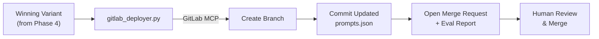

# Phase 5: GitLab DevSecOps via MCP

> **Goal**: Integrate the GitLab MCP Server so the agent can autonomously create branches, commit optimized prompt configs, and open Merge Requests with rich evaluation reports — all through MCP tool calls.
>
> **Estimated Time**: 2-3 hours

---

## 5.1 Overview

This phase creates the deployment layer that connects the optimization loop to GitLab:



### Why GitLab MCP (Not REST API)?
- **Hackathon requirement**: Must integrate a partner's MCP server
- **Agent-native**: MCP tools are callable directly by ADK agents
- **Standardized**: Same interface regardless of Git provider
- **Two-partner bonus**: Using both Arize MCP + GitLab MCP strengthens the submission

---

## 5.2 GitLab MCP Server Setup

### Prerequisites
1. **GitLab account** with a target repository (e.g., `your-username/prompt-configs`)
2. **Personal Access Token (PAT)** with `api`, `read_repository`, `write_repository` scopes
3. **Node.js v18+** for `npx`

### Target Repository Setup
Create a GitLab repository to hold prompt configs:

```bash
# Option A: Create via GitLab UI
# Go to gitlab.com → New Project → "prompt-configs"

# Option B: Push existing prompts to GitLab
cd /run/media/Saksham/Saksham/Code/Projects/AG-Agent-Hack
git remote add gitlab https://gitlab.com/your-username/prompt-configs.git
# Copy prompts.json to the repo root
cp src/prompts.json prompts.json
git add prompts.json
git commit -m "Initial prompt configuration"
git push gitlab main
```

### MCP Connection via ADK
```python
from mcp import StdioServerParameters
from google.adk.tools import McpToolset

gitlab_params = StdioServerParameters(
    command="npx",
    args=["-y", "@structured-world/gitlab-mcp"],
    env={
        "GITLAB_PERSONAL_ACCESS_TOKEN": os.getenv("GITLAB_PERSONAL_ACCESS_TOKEN"),
        "GITLAB_API_URL": "https://gitlab.com/api/v4",
    }
)

gitlab_toolset = McpToolset(connection_params=gitlab_params)
```

---

## 5.3 Available GitLab MCP Tools

| Tool | Purpose | Key Parameters |
|---|---|---|
| `create_branch` | Create a feature branch | `id`, `branch`, `ref` (base branch) |
| `create_or_update_file` | Commit a file change | `id`, `file_path`, `content`, `branch`, `commit_message` |
| `create_merge_request` | Open an MR | `id`, `title`, `source_branch`, `target_branch`, `description` |
| `list_merge_requests` | List existing MRs | `id`, `state` |
| `get_merge_request` | Get MR details | `id`, `merge_request_iid` |
| `search_issues` | Search issues | `search`, `scope` |

---

## 5.4 Build the GitLab Deployer Module

### `src/agent/gitlab_deployer.py`

```python
"""
GitLab Deployer Module — Autonomous prompt deployment via GitLab MCP.

Takes an evaluation report with the winning variant, creates a feature
branch, commits the updated prompts.json, and opens a Merge Request
with a rich evaluation dashboard in the description.
"""

import json
import os
from datetime import datetime
from dataclasses import dataclass

from google.adk.agents import Agent
from google.adk.tools import McpToolset
from mcp import StdioServerParameters

from src.agent.evaluator import EvaluationReport, VariantScorecard
from src.agent.optimizer import PromptVariant


@dataclass
class DeploymentResult:
    """Result of a GitLab deployment."""
    branch_name: str
    commit_sha: str
    mr_url: str
    mr_iid: int
    status: str     # "success", "failed"
    error: str | None


class GitLabDeployer:
    """Handles autonomous deployment of optimized prompts to GitLab."""
    
    def __init__(self):
        self.project_id = os.getenv("GITLAB_PROJECT_ID")  # e.g., "username/prompt-configs"
        self.default_branch = os.getenv("GITLAB_DEFAULT_BRANCH", "main")
        
        # Initialize GitLab MCP connection
        self.gitlab_params = StdioServerParameters(
            command="npx",
            args=["-y", "@structured-world/gitlab-mcp"],
            env={
                "GITLAB_PERSONAL_ACCESS_TOKEN": os.getenv("GITLAB_PERSONAL_ACCESS_TOKEN"),
                "GITLAB_API_URL": os.getenv("GITLAB_API_URL", "https://gitlab.com/api/v4"),
            }
        )
    
    async def deploy_winner(
        self,
        eval_report: EvaluationReport,
        prompt_id: str,
        current_version: str,
    ) -> DeploymentResult:
        """
        Deploy the winning prompt variant to GitLab.
        
        Steps:
        1. Create a feature branch
        2. Update prompts.json with the winning variant
        3. Open a Merge Request with evaluation report
        """
        winner = eval_report.winner_variant
        new_version = self._bump_version(current_version)
        branch_name = f"optimize-{prompt_id}-v{new_version}"
        
        async with McpToolset(connection_params=self.gitlab_params) as toolset:
            tools = await toolset.load_tools()
            
            # Step 1: Create feature branch
            create_branch_tool = next(t for t in tools if t.name == "create_branch")
            await create_branch_tool.run({
                "id": self.project_id,
                "branch": branch_name,
                "ref": self.default_branch,
            })
            
            # Step 2: Update prompts.json
            updated_prompts = self._build_updated_prompts(
                prompt_id, winner, new_version
            )
            
            update_file_tool = next(t for t in tools if t.name == "create_or_update_file")
            commit_result = await update_file_tool.run({
                "id": self.project_id,
                "file_path": "prompts.json",
                "branch": branch_name,
                "content": json.dumps(updated_prompts, indent=2),
                "commit_message": (
                    f"feat: optimize {prompt_id} prompt v{current_version} → v{new_version}\n\n"
                    f"Strategy: {winner.strategy}\n"
                    f"Accuracy: {eval_report.original_scorecard.accuracy:.1%} → "
                    f"{eval_report.winner.accuracy:.1%} "
                    f"(+{eval_report.winner.improvement_vs_original:.1%})\n\n"
                    f"Auto-generated by LLM Eval-to-Improvement Loop Agent"
                ),
            })
            
            # Step 3: Open Merge Request with rich description
            mr_description = self._build_mr_description(eval_report, prompt_id, new_version)
            
            create_mr_tool = next(t for t in tools if t.name == "create_merge_request")
            mr_result = await create_mr_tool.run({
                "id": self.project_id,
                "title": f"🤖 Optimize: {prompt_id} v{new_version} (+{eval_report.winner.improvement_vs_original:.1%} accuracy)",
                "source_branch": branch_name,
                "target_branch": self.default_branch,
                "description": mr_description,
            })
        
        return DeploymentResult(
            branch_name=branch_name,
            commit_sha=commit_result.get("sha", "unknown"),
            mr_url=mr_result.get("web_url", ""),
            mr_iid=mr_result.get("iid", 0),
            status="success",
            error=None,
        )
    
    def _build_updated_prompts(self, prompt_id: str, winner: PromptVariant, new_version: str) -> dict:
        """Build the updated prompts.json with the winning variant."""
        # Load current prompts
        from pathlib import Path
        prompts_path = Path(__file__).parent.parent / "prompts.json"
        with open(prompts_path) as f:
            prompts = json.load(f)
        
        # Update the target prompt
        prompts["prompts"][prompt_id]["system_instruction"] = winner.system_instruction
        prompts["prompts"][prompt_id]["version"] = new_version
        prompts["prompts"][prompt_id]["metadata"]["last_optimized_at"] = datetime.utcnow().isoformat()
        prompts["prompts"][prompt_id]["metadata"]["optimization_count"] += 1
        prompts["prompts"][prompt_id]["metadata"]["optimization_strategy"] = winner.strategy
        prompts["prompts"][prompt_id]["metadata"]["previous_version"] = prompts["prompts"][prompt_id].get("version", "1.0.0")
        
        return prompts
    
    def _bump_version(self, version: str) -> str:
        """Increment the minor version. 1.0.0 → 1.1.0"""
        parts = version.split(".")
        parts[1] = str(int(parts[1]) + 1)
        return ".".join(parts)
    
    def _build_mr_description(self, report: EvaluationReport, prompt_id: str, new_version: str) -> str:
        """
        Build a rich Markdown MR description with evaluation metrics.
        This is the "eval dashboard" that makes the MR informative.
        """
        original = report.original_scorecard
        winner = report.winner
        
        description = f"""
## 🤖 Automated Prompt Optimization Report

**Agent**: LLM Eval-to-Improvement Loop Agent  
**Prompt**: `{prompt_id}`  
**Version**: `{original.variant_id}` → `v{new_version}`  
**Strategy**: {winner.strategy}  
**Confidence**: {report.confidence}

---

### 📊 Performance Summary

| Metric | Before | After | Change |
|--------|--------|-------|--------|
| **Overall Accuracy** | {original.accuracy:.1%} | {winner.accuracy:.1%} | +{winner.improvement_vs_original:.1%} |
| **Avg Latency** | {original.avg_latency_ms:.0f}ms | {winner.avg_latency_ms:.0f}ms | {winner.avg_latency_ms - original.avg_latency_ms:+.0f}ms |
| **Avg Tokens** | {original.avg_tokens:.0f} | {winner.avg_tokens:.0f} | {winner.avg_tokens - original.avg_tokens:+.0f} |

### 📈 Category Breakdown

| Category | Before | After | Change |
|----------|--------|-------|--------|
"""
        for cat in sorted(set(list(original.category_scores.keys()) + list(winner.category_scores.keys()))):
            orig_score = original.category_scores.get(cat, 0)
            win_score = winner.category_scores.get(cat, 0)
            delta = win_score - orig_score
            emoji = "✅" if delta > 0 else "⚠️" if delta < 0 else "➡️"
            description += f"| {cat} | {orig_score:.0%} | {win_score:.0%} | {delta:+.0%} {emoji} |\n"
        
        description += f"""
### 🏆 Variant Comparison

| Variant | Strategy | Accuracy | Latency | Selected |
|---------|----------|----------|---------|----------|
| Original | baseline | {original.accuracy:.1%} | {original.avg_latency_ms:.0f}ms | |
"""
        for v in report.variant_scorecards:
            selected = "✅" if v.variant_id == winner.variant_id else ""
            description += f"| {v.variant_id} | {v.strategy} | {v.accuracy:.1%} | {v.avg_latency_ms:.0f}ms | {selected} |\n"
        
        description += f"""
### 📝 Changes Made
{report.winner_variant.changes_description}

### ⚠️ Remaining Failures
"""
        if winner.failing_query_ids:
            for qid in winner.failing_query_ids:
                description += f"- `{qid}` — still failing\n"
        else:
            description += "None! All test cases pass. 🎉\n"
        
        description += f"""
---

> **Generated by**: LLM Eval-to-Improvement Loop Agent  
> **Powered by**: Gemini + Arize Phoenix + GitLab MCP  
> **Timestamp**: {datetime.utcnow().isoformat()}Z
"""
        return description
```

---

## 5.5 ADK Agent Integration

The deployer can also be wrapped as an ADK agent for the orchestrator:

```python
from google.adk.agents import Agent

deployer_agent = Agent(
    name="deployer_agent",
    model="gemini-2.5-flash",
    description="Deploys optimized prompts to GitLab via MCP",
    instruction="""You are a deployment agent. When given an optimization result:
    1. Use GitLab MCP tools to create a feature branch
    2. Commit the updated prompts.json
    3. Open a Merge Request with the evaluation report
    4. Return the MR URL for human review
    
    Always use descriptive commit messages and branch names.
    """,
    tools=[gitlab_toolset],
)
```

---

## 5.6 Verification Steps

### Step 1: Test GitLab MCP Connection
```bash
# Verify the MCP server can connect to GitLab
python -c "
import asyncio
from mcp import StdioServerParameters
from google.adk.tools import McpToolset

async def test():
    params = StdioServerParameters(
        command='npx',
        args=['-y', '@structured-world/gitlab-mcp'],
        env={
            'GITLAB_PERSONAL_ACCESS_TOKEN': 'your-token',
            'GITLAB_API_URL': 'https://gitlab.com/api/v4',
        }
    )
    async with McpToolset(connection_params=params) as toolset:
        tools = await toolset.load_tools()
        print(f'Available tools: {[t.name for t in tools]}')

asyncio.run(test())
"
```

### Step 2: Test Branch Creation
```bash
python -c "
# Create a test branch and verify on GitLab
from src.agent.gitlab_deployer import GitLabDeployer
# ... test create_branch ...
"
```

### Step 3: Test Full MR Creation
```bash
python -c "
# Run the full deployment with a mock evaluation report
from src.agent.gitlab_deployer import GitLabDeployer
from src.agent.evaluator import EvaluationReport
# ... test deploy_winner() with mock data ...
"
```

### Step 4: Verify on GitLab
1. Check the target repository on GitLab
2. Verify the feature branch was created
3. Open the Merge Request and review:
   - Title includes accuracy improvement
   - Description has the evaluation table
   - `prompts.json` diff shows the prompt change
   - Commit message is descriptive

---

## 5.7 Completion Checklist

- [ ] GitLab MCP Server connects successfully via `McpToolset`
- [ ] Available MCP tools listed (create_branch, create_or_update_file, create_merge_request)
- [ ] `src/agent/gitlab_deployer.py` implemented with full deployment flow
- [ ] Feature branch creation works (named `optimize-{prompt_id}-v{version}`)
- [ ] `prompts.json` updated correctly with winning variant
- [ ] Commit message includes version bump, strategy, and accuracy change
- [ ] Merge Request opens with rich Markdown evaluation report
- [ ] MR description includes performance tables, category breakdown, variant comparison
- [ ] End-to-end deployment test passes (branch → commit → MR)
- [ ] MR is visible and readable on GitLab web UI

---

> **Next Phase**: [Phase 6: Web Dashboard & Orchestrator →](06_dashboard.md)
