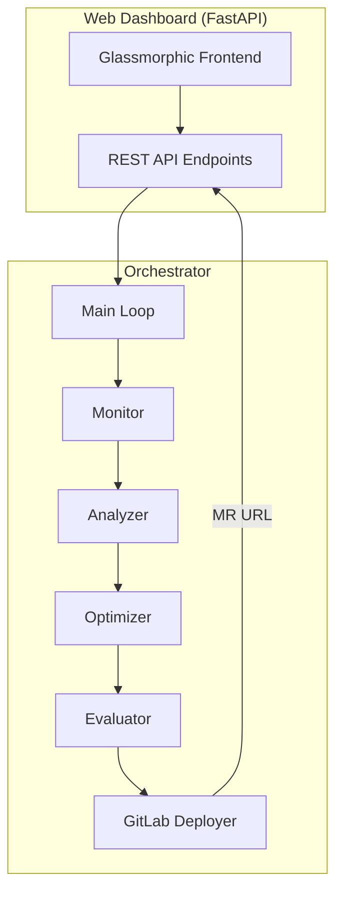

# Phase 6: Web Dashboard & Orchestrator

> **Goal**: Build the premium web dashboard (FastAPI + Vanilla CSS/JS) as the agent's control panel, and the orchestrator module that ties the entire Monitor → Analyze → Optimize → Evaluate → Deploy loop together.
>
> **Estimated Time**: 4-5 hours

---

## 6.1 Overview

This phase delivers the **two capstone components**:

| Component | Purpose |
|---|---|
| `orchestrator.py` | Main loop tying all 5 stages into an autonomous pipeline |
| Web Dashboard | Premium glassmorphic UI for monitoring, triggering, and reviewing optimizations |

### Architecture


---

## 6.2 Build the Orchestrator

### `src/agent/orchestrator.py`

The orchestrator runs the full improvement loop either as a one-shot execution or as a continuous background process.

```python
"""
Orchestrator — Ties the full eval-to-improvement loop together.

Runs the autonomous pipeline:
  Monitor → Analyze → Optimize → Evaluate → Deploy

Can be triggered from:
  - CLI: python -m src.agent.orchestrator
  - Dashboard API: POST /api/optimize
  - Continuous mode: runs every N minutes
"""

import asyncio
import json
import os
import logging
from dataclasses import dataclass, field
from datetime import datetime
from pathlib import Path
from enum import Enum

from src.agent.monitor import PromptMonitor
from src.agent.analyzer import FailureAnalyzer
from src.agent.optimizer import PromptOptimizer
from src.agent.evaluator import ShadowEvaluator
from src.agent.gitlab_deployer import GitLabDeployer


class RunStatus(Enum):
    PENDING = "pending"
    MONITORING = "monitoring"
    ANALYZING = "analyzing"
    OPTIMIZING = "optimizing"
    EVALUATING = "evaluating"
    DEPLOYING = "deploying"
    COMPLETED = "completed"
    FAILED = "failed"
    NO_ACTION = "no_action"


@dataclass
class OrchestrationRun:
    """Record of a single orchestration run."""
    run_id: str
    started_at: str
    status: RunStatus
    prompt_id: str | None = None
    original_score: float | None = None
    winner_score: float | None = None
    improvement: float | None = None
    mr_url: str | None = None
    error: str | None = None
    completed_at: str | None = None
    stages_log: list[dict] = field(default_factory=list)


class Orchestrator:
    """Main orchestration engine for the improvement loop."""
    
    def __init__(self):
        self.monitor = PromptMonitor()
        self.analyzer = FailureAnalyzer()
        self.optimizer = PromptOptimizer()
        self.evaluator = ShadowEvaluator()
        self.deployer = GitLabDeployer()
        
        # Run history (in-memory, exposed via dashboard API)
        self.runs: list[OrchestrationRun] = []
        self.current_run: OrchestrationRun | None = None
        
        self.logger = logging.getLogger("orchestrator")
    
    async def run_once(self, project_name: str = "electrogadget-hub") -> OrchestrationRun:
        """
        Execute a single improvement loop iteration.
        
        Returns:
            OrchestrationRun with results
        """
        run = OrchestrationRun(
            run_id=f"run-{datetime.utcnow().strftime('%Y%m%d-%H%M%S')}",
            started_at=datetime.utcnow().isoformat(),
            status=RunStatus.MONITORING,
        )
        self.current_run = run
        self.runs.append(run)
        
        try:
            # Stage 1: MONITOR — Find underperforming prompts
            self._log_stage(run, "monitor", "Scanning Phoenix Cloud for underperforming prompts...")
            run.status = RunStatus.MONITORING
            
            underperforming = self.monitor.get_underperforming_prompts(project_name)
            
            if not underperforming:
                run.status = RunStatus.NO_ACTION
                self._log_stage(run, "monitor", "All prompts above threshold. No action needed.")
                run.completed_at = datetime.utcnow().isoformat()
                return run
            
            # Take the worst-performing prompt
            target = min(underperforming, key=lambda r: r.eval_score)
            run.prompt_id = target.prompt_id
            run.original_score = target.eval_score
            self._log_stage(run, "monitor", f"Found: {target.prompt_id} at {target.eval_score:.1%}")
            
            # Stage 2: ANALYZE — Diagnose failures
            run.status = RunStatus.ANALYZING
            self._log_stage(run, "analyze", "Clustering failure patterns...")
            
            prompt_config = self._load_prompt_config(target.prompt_id)
            diagnostic = self.analyzer.analyze_failures(
                failing_traces=target.failing_trace_ids,
                prompt_config=prompt_config,
            )
            self._log_stage(run, "analyze", f"Found {len(diagnostic.failure_clusters)} failure clusters")
            
            # Stage 3: OPTIMIZE — Generate improved variants
            run.status = RunStatus.OPTIMIZING
            self._log_stage(run, "optimize", "Generating 3 prompt variants with Gemini...")
            
            variants = self.optimizer.generate_variants(diagnostic)
            self._log_stage(run, "optimize", f"Generated: {[v.variant_id for v in variants]}")
            
            # Stage 4: EVALUATE — Shadow evaluation
            run.status = RunStatus.EVALUATING
            self._log_stage(run, "evaluate", "Running shadow evaluations against golden dataset...")
            
            eval_report = self.evaluator.run_full_evaluation(
                original_prompt=diagnostic.original_prompt,
                variants=variants,
            )
            run.winner_score = eval_report.winner.accuracy
            run.improvement = eval_report.winner.improvement_vs_original
            self._log_stage(run, "evaluate", 
                f"Winner: {eval_report.winner.variant_id} at {eval_report.winner.accuracy:.1%} "
                f"(+{eval_report.winner.improvement_vs_original:.1%})"
            )
            
            # Stage 5: DEPLOY — Open GitLab MR
            run.status = RunStatus.DEPLOYING
            self._log_stage(run, "deploy", "Creating GitLab branch and Merge Request...")
            
            deployment = await self.deployer.deploy_winner(
                eval_report=eval_report,
                prompt_id=target.prompt_id,
                current_version=prompt_config["version"],
            )
            run.mr_url = deployment.mr_url
            self._log_stage(run, "deploy", f"MR created: {deployment.mr_url}")
            
            # Done!
            run.status = RunStatus.COMPLETED
            run.completed_at = datetime.utcnow().isoformat()
            self._log_stage(run, "complete", 
                f"✅ Optimization complete! "
                f"{run.original_score:.1%} → {run.winner_score:.1%} "
                f"(+{run.improvement:.1%})"
            )
            
        except Exception as e:
            run.status = RunStatus.FAILED
            run.error = str(e)
            run.completed_at = datetime.utcnow().isoformat()
            self._log_stage(run, "error", f"❌ Failed: {e}")
            self.logger.exception("Orchestration failed")
        
        self.current_run = None
        return run
    
    def _load_prompt_config(self, prompt_id: str) -> dict:
        """Load a prompt config from prompts.json."""
        prompts_path = Path(__file__).parent.parent / "prompts.json"
        with open(prompts_path) as f:
            data = json.load(f)
        return data["prompts"][prompt_id]
    
    def _log_stage(self, run: OrchestrationRun, stage: str, message: str):
        """Log a stage update to the run record."""
        entry = {
            "timestamp": datetime.utcnow().isoformat(),
            "stage": stage,
            "message": message,
        }
        run.stages_log.append(entry)
        self.logger.info(f"[{run.run_id}] [{stage}] {message}")
    
    def get_run_history(self) -> list[dict]:
        """Get all run records as dicts (for API serialization)."""
        return [
            {
                "run_id": r.run_id,
                "started_at": r.started_at,
                "completed_at": r.completed_at,
                "status": r.status.value,
                "prompt_id": r.prompt_id,
                "original_score": r.original_score,
                "winner_score": r.winner_score,
                "improvement": r.improvement,
                "mr_url": r.mr_url,
                "error": r.error,
                "stages_log": r.stages_log,
            }
            for r in self.runs
        ]


# CLI Entry Point
if __name__ == "__main__":
    import argparse
    
    parser = argparse.ArgumentParser(description="Run the improvement loop")
    parser.add_argument("--project", default="electrogadget-hub", help="Phoenix project name")
    args = parser.parse_args()
    
    logging.basicConfig(level=logging.INFO, format="%(asctime)s [%(name)s] %(message)s")
    
    orchestrator = Orchestrator()
    result = asyncio.run(orchestrator.run_once(args.project))
    
    print(f"\n{'='*60}")
    print(f"Run: {result.run_id}")
    print(f"Status: {result.status.value}")
    if result.mr_url:
        print(f"MR: {result.mr_url}")
    if result.error:
        print(f"Error: {result.error}")
```

---

## 6.3 Build the Web Dashboard

### Design System
- **Theme**: Dark glassmorphic with HSL color palette
- **Colors**: Deep navy background, teal/cyan accents, glass cards
- **Typography**: Inter (Google Fonts)
- **Animations**: Smooth transitions, pulse indicators, progress bars

### Dashboard Features
1. **Status Overview**: Live status of the orchestrator (idle/running/stage)
2. **Prompt Performance Cards**: Current scores for each prompt template
3. **Run History**: Timeline of past optimization runs with results
4. **Trigger Button**: Manual "Run Optimization" control
5. **MR Links**: Direct links to generated Merge Requests
6. **Live Logs**: Real-time stage-by-stage progress

---

### `src/dashboard/app.py` — FastAPI Backend

```python
"""
Web Dashboard — FastAPI backend for the improvement loop agent.

Provides API endpoints for:
- Viewing prompt performance
- Triggering optimization runs
- Viewing run history and live status
- Linking to GitLab Merge Requests
"""

import asyncio
from fastapi import FastAPI, Request
from fastapi.staticfiles import StaticFiles
from fastapi.templating import Jinja2Templates
from fastapi.responses import JSONResponse
from pathlib import Path

from src.agent.orchestrator import Orchestrator

app = FastAPI(title="LLM Eval-to-Improvement Loop", version="1.0.0")

# Static files and templates
BASE_DIR = Path(__file__).parent
app.mount("/static", StaticFiles(directory=BASE_DIR / "static"), name="static")
templates = Jinja2Templates(directory=BASE_DIR / "templates")

# Shared orchestrator instance
orchestrator = Orchestrator()


@app.get("/")
async def dashboard(request: Request):
    """Serve the main dashboard page."""
    return templates.TemplateResponse("index.html", {"request": request})


@app.get("/api/status")
async def get_status():
    """Get current orchestrator status."""
    current = orchestrator.current_run
    return {
        "status": current.status.value if current else "idle",
        "current_run": {
            "run_id": current.run_id,
            "prompt_id": current.prompt_id,
            "stages_log": current.stages_log,
        } if current else None,
    }


@app.get("/api/runs")
async def get_runs():
    """Get run history."""
    return {"runs": orchestrator.get_run_history()}


@app.post("/api/optimize")
async def trigger_optimization():
    """Trigger a manual optimization run."""
    if orchestrator.current_run:
        return JSONResponse(
            status_code=409,
            content={"error": "Optimization already in progress"}
        )
    
    # Run in background
    asyncio.create_task(orchestrator.run_once())
    return {"status": "started", "message": "Optimization run triggered"}


@app.get("/api/prompts")
async def get_prompts():
    """Get current prompt configurations and their performance."""
    import json
    prompts_path = Path(__file__).parent.parent / "prompts.json"
    with open(prompts_path) as f:
        data = json.load(f)
    return data


# Run with: uvicorn src.dashboard.app:app --reload --port 8000
```

---

### `src/dashboard/templates/index.html` — Dashboard Page

Build a premium, dark-mode glassmorphic single-page application with:

**Header Section:**
- Project title with gradient text
- Live status indicator (pulsing dot: green=idle, blue=running, red=error)
- "Run Optimization" button with hover glow effect

**Main Grid (3 columns):**

**Column 1 — Prompt Performance Cards:**
- Glass cards showing each prompt template
- Current accuracy score with circular progress indicator
- Version number and last optimization date
- Category breakdown as small bar charts

**Column 2 — Live Pipeline View:**
- Vertical stepper showing: Monitor → Analyze → Optimize → Evaluate → Deploy
- Active step highlighted with pulse animation
- Completed steps show green checkmarks
- Real-time log messages for active step

**Column 3 — Run History:**
- Timeline of past runs
- Each entry shows: timestamp, prompt ID, score improvement, MR link
- Color-coded status badges (success=green, failed=red, no_action=gray)

**Design Specifications:**
```css
/* Color Palette (HSL) */
--bg-primary: hsl(222, 47%, 8%);      /* Deep navy */
--bg-secondary: hsl(222, 40%, 12%);    /* Slightly lighter */
--glass-bg: hsla(222, 40%, 18%, 0.6);  /* Glass card background */
--glass-border: hsla(0, 0%, 100%, 0.08); /* Subtle border */
--accent-primary: hsl(172, 80%, 50%);  /* Teal/cyan */
--accent-secondary: hsl(262, 80%, 60%); /* Purple */
--text-primary: hsl(0, 0%, 95%);
--text-secondary: hsl(0, 0%, 65%);
--success: hsl(142, 70%, 50%);
--danger: hsl(0, 70%, 55%);
--warning: hsl(38, 90%, 55%);
```

```css
/* Glass Card Effect */
.glass-card {
    background: var(--glass-bg);
    backdrop-filter: blur(20px);
    -webkit-backdrop-filter: blur(20px);
    border: 1px solid var(--glass-border);
    border-radius: 16px;
    padding: 24px;
    transition: transform 0.3s ease, box-shadow 0.3s ease;
}

.glass-card:hover {
    transform: translateY(-2px);
    box-shadow: 0 8px 32px hsla(172, 80%, 50%, 0.15);
}
```

---

## 6.4 ADK Root Agent Definition

### `src/agent/agent.py` — The ADK Root Agent

This wraps everything into a proper Google ADK agent with MCP tools:

```python
"""
Root ADK Agent — LLM Eval-to-Improvement Loop Agent

A multi-agent system built with Google ADK that autonomously monitors,
diagnoses, optimizes, evaluates, and deploys LLM prompt improvements.
"""

import os
from dotenv import load_dotenv

from google.adk.agents import Agent, SequentialAgent
from google.adk.tools import McpToolset
from mcp import StdioServerParameters

load_dotenv()

# --- MCP Server Connections ---

phoenix_toolset = McpToolset(
    connection_params=StdioServerParameters(
        command="npx",
        args=[
            "-y", "@arizeai/phoenix-mcp@latest",
            "--baseUrl", os.getenv("PHOENIX_COLLECTOR_ENDPOINT", "").rsplit("/v1", 1)[0],
            "--apiKey", os.getenv("PHOENIX_API_KEY", ""),
        ]
    )
)

gitlab_toolset = McpToolset(
    connection_params=StdioServerParameters(
        command="npx",
        args=["-y", "@structured-world/gitlab-mcp"],
        env={
            "GITLAB_PERSONAL_ACCESS_TOKEN": os.getenv("GITLAB_PERSONAL_ACCESS_TOKEN", ""),
            "GITLAB_API_URL": os.getenv("GITLAB_API_URL", "https://gitlab.com/api/v4"),
        }
    )
)

# --- Sub-Agents ---

monitor_agent = Agent(
    name="monitor",
    model="gemini-2.5-flash",
    description="Monitors LLM trace performance in Arize Phoenix",
    instruction="""You monitor LLM traces in Phoenix Cloud. Your job is to:
    1. Query the 'electrogadget-hub' project for recent traces
    2. Evaluate trace quality using correctness criteria
    3. Identify prompt templates scoring below 85% accuracy
    4. Report underperforming prompts with failure details
    """,
    tools=[phoenix_toolset],
)

analyzer_agent = Agent(
    name="analyzer",
    model="gemini-2.5-flash",
    description="Diagnoses failure patterns in underperforming prompts",
    instruction="""You analyze failing traces to understand WHY prompts fail.
    1. Cluster failures by query category and failure pattern
    2. Identify root causes (missing instructions, ambiguous wording, etc.)
    3. Generate specific improvement suggestions
    4. Produce a structured diagnostic report
    """,
)

optimizer_agent = Agent(
    name="optimizer",
    model="gemini-2.5-flash",
    description="Generates improved prompt variants using diagnostic data",
    instruction="""You generate improved prompt variants. Given a diagnostic report:
    1. Create 3 variants: conservative, moderate, aggressive
    2. Each must be a complete, standalone system prompt
    3. Target the specific failure patterns identified
    4. Ensure the tone and domain context are preserved
    """,
)

evaluator_agent = Agent(
    name="evaluator",
    model="gemini-2.5-flash",
    description="Runs shadow evaluations to select the best variant",
    instruction="""You evaluate prompt variants against a golden dataset.
    1. Test each variant (+ original) against all golden queries
    2. Score responses using LLM-as-a-Judge criteria
    3. Compute accuracy, latency, and cost metrics
    4. Select the winner with statistical confidence
    """,
)

deployer_agent = Agent(
    name="deployer",
    model="gemini-2.5-flash",
    description="Deploys winning prompts to GitLab via MCP",
    instruction="""You deploy optimized prompts to GitLab. For each winning variant:
    1. Create a feature branch named 'optimize-{prompt_id}-v{version}'
    2. Commit the updated prompts.json
    3. Open a Merge Request with a detailed evaluation report
    4. Return the MR URL for human review
    """,
    tools=[gitlab_toolset],
)

# --- Root Agent (Sequential Pipeline) ---

root_agent = SequentialAgent(
    name="eval_improvement_loop",
    description="Autonomous LLM Eval-to-Improvement Loop Agent",
    sub_agents=[monitor_agent, analyzer_agent, optimizer_agent, evaluator_agent, deployer_agent],
)
```

---

## 6.5 Verification Steps

### Step 1: Test the Orchestrator (CLI)
```bash
source .venv/bin/activate
python -m src.agent.orchestrator --project electrogadget-hub
```
Expected output:
```
[monitor] Scanning Phoenix Cloud for underperforming prompts...
[monitor] Found: customer_support at 55.0%
[analyze] Clustering failure patterns...
[analyze] Found 3 failure clusters
[optimize] Generating 3 prompt variants with Gemini...
[evaluate] Running shadow evaluations against golden dataset...
[evaluate] Winner: v3_aggressive at 95.0% (+40.0%)
[deploy] Creating GitLab branch and Merge Request...
[deploy] MR created: https://gitlab.com/user/prompt-configs/-/merge_requests/1
[complete] ✅ Optimization complete! 55.0% → 95.0% (+40.0%)
```

### Step 2: Test the Dashboard
```bash
uvicorn src.dashboard.app:app --reload --port 8000
# Open http://localhost:8000 in browser
```

### Step 3: Test API Endpoints
```bash
# Status
curl http://localhost:8000/api/status

# Trigger optimization
curl -X POST http://localhost:8000/api/optimize

# Get run history
curl http://localhost:8000/api/runs

# Get prompt configs
curl http://localhost:8000/api/prompts
```

### Step 4: Test ADK Agent
```bash
adk web src/agent
# Open the ADK web UI and interact with the agent
```

---

## 6.6 Completion Checklist

- [ ] `src/agent/orchestrator.py` implemented with full 5-stage pipeline
- [ ] CLI entry point works (`python -m src.agent.orchestrator`)
- [ ] Run history tracked in memory with stage-by-stage logging
- [ ] `src/dashboard/app.py` serves the dashboard at `http://localhost:8000`
- [ ] API endpoints work: `/api/status`, `/api/runs`, `/api/optimize`, `/api/prompts`
- [ ] Dashboard frontend has glassmorphic dark theme
- [ ] Live status indicator shows orchestrator state
- [ ] "Run Optimization" button triggers the pipeline
- [ ] Run history timeline displays past runs
- [ ] MR links are clickable in the dashboard
- [ ] `src/agent/agent.py` defines the ADK root agent with MCP tools
- [ ] ADK agent can be tested via `adk web`
- [ ] Full E2E: Dashboard trigger → Monitor → Analyze → Optimize → Evaluate → Deploy → MR

---

> **Next Phase**: [Phase 7: Polish, Testing & Submission →](07_polish.md)
