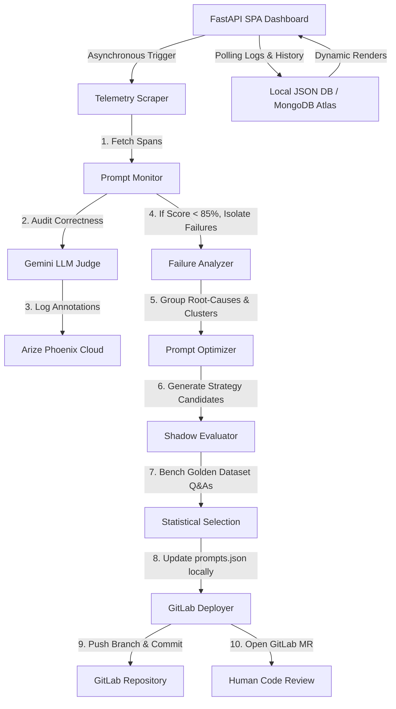

# 📈 Project Status: Autonomous LLM Eval-to-Improvement Agent

An autonomous, production-grade **LLM Eval-to-Improvement Loop Agent** that monitors customer conversation telemetry, audits responses using Gemini as an LLM judge, clusters/diagnoses prompt failures, programmatically engineers improved prompts, performs shadow evaluations against a golden dataset, and automates MR deployment via GitLab.

---

## 🔍 What it Does

This system closes the loop on LLM prompt engineering. Instead of manually inspecting logs and tweaking prompts, this agent:
1. **Audits Live Outputs**: Inspects incoming conversational traces for policy compliance and correctness.
2. **Diagnoses Root-Causes**: Groups and clusters failing interactions (e.g., out-of-scope queries, procedural errors).
3. **Optimizes Prompts**: Synthesizes and tests three targeted prompt strategies (conservative, structural, few-shot).
4. **Validates & Deploys**: Verifies prompt safety/accuracy using shadow evaluations on a golden dataset and deploys winning variants via automated GitLab Merge Requests.

---

## ⚡ Features Implemented

*   **Introspective Prompt Monitor (`monitor.py`)**: Pulls trace spans from Arize Phoenix Cloud, evaluates them using a correctness judge, and syncs annotations back to Phoenix.
*   **Structured Failure Analyzer (`analyzer.py`)**: Uses Pydantic structured output parsing with Gemini to group failed interactions into root-cause clusters with severity tags.
*   **Multi-Strategy Optimizer (`optimizer.py`)**: Generates three distinct system prompt candidates:
    *   *Conservative surgical fixes* (targeted corrections).
    *   *Moderate structured workflows* (strict procedural rules).
    *   *Aggressive few-shot + negative constraints* (in-context learning + guardrails).
*   **Double-Layer Shadow Evaluator (`evaluator.py`)**: Runs shadow evaluations against a golden dataset (`golden_dataset.json`) using expected substring matching paired with zero-temperature LLM-as-a-Judge correctness checks.
*   **GitOps GitLab Deployer (`gitlab_deployer.py`)**: Handles automated branch creation, local `prompts.json` updates, commits, pushes, and opens GitLab MRs complete with rich Markdown metric comparisons.
*   **FastAPI Control Center Dashboard (`dashboard/app.py`)**: A premium HSL-tailored glassmorphism SPA dashboard displaying active metrics, terminal output logs, pipeline stage progress, and historic GitLab MR triggers.
*   **Unified Singleton Orchestrator (`orchestrator.py`)**: Coordinates the asynchronous execution loop and maintains run history (persisted locally to JSON or remotely to MongoDB Atlas).

---

## 🔄 End-to-End Project Flow

---

## 📊 Telemetry & Dataflow

1.  **Ingress Trace Fetching**:
    *   Retrieves live customer conversational traces (`input`, `output`, `system_instructions`, and metadata) from Arize Phoenix Cloud using the client API.
2.  **Correctness Audit & Back-sync**:
    *   A Gemini-powered judge scores logs. Spans are annotated (`correct`/`incorrect` labels and reasoning) and pushed back to the OTel collector on Arize Phoenix.
3.  **Root-Cause Diagnosis & Candidate Bench**:
    *   Failing traces are structured and optimized. The baseline prompt and 3 new candidate configurations are fed to the shadow evaluator.
4.  **Verification & GitOps Ingress**:
    *   Candidates are benched against the `golden_dataset.json` (50+ high-fidelity QA pairs).
    *   The statistically best-performing strategy is selected. If it outperforms the baseline, `prompts.json` is updated, committed, and a GitLab MR is generated.
5.  **State Persistence**:
    *   Run records, timestamps, diagnostic clusters, baseline/final accuracies, and MR URLs are saved to the persistent history store (MongoDB Atlas with local JSON fallback).
